# AWS Nested Stack - VPC and Security Setup

This project demonstrates how to use AWS CloudFormation Nested Stacks to create a modular infrastructure setup.

The root stack orchestrates two child stacks:
- Network Stack
- Security Stack

The infrastructure is fully parameterized and follows best practices for stack dependency and output passing.

---

## 📌 Project Architecture

Root Stack  
│  
├── Network Stack  
│     ├── VPC  
│     ├── 2 Public Subnets  
│     └── 2 Private Subnets  
│  
└── Security Stack  
      ├── Load Balancer Security Group  
      └── Web Server Security Group  

---

## 🚀 Steps Performed

### 1️⃣ Created Network Stack
- Defined VPC with CIDR block
- Created 2 Public and 2 Private subnets
- Attached Internet Gateway
- Exported VPC ID and Subnet IDs using Outputs

📷 Screenshot:
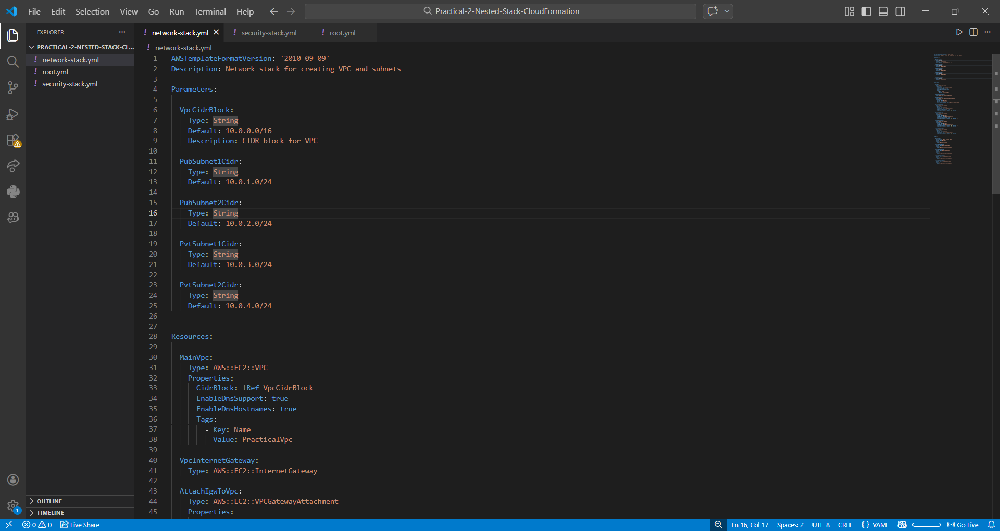
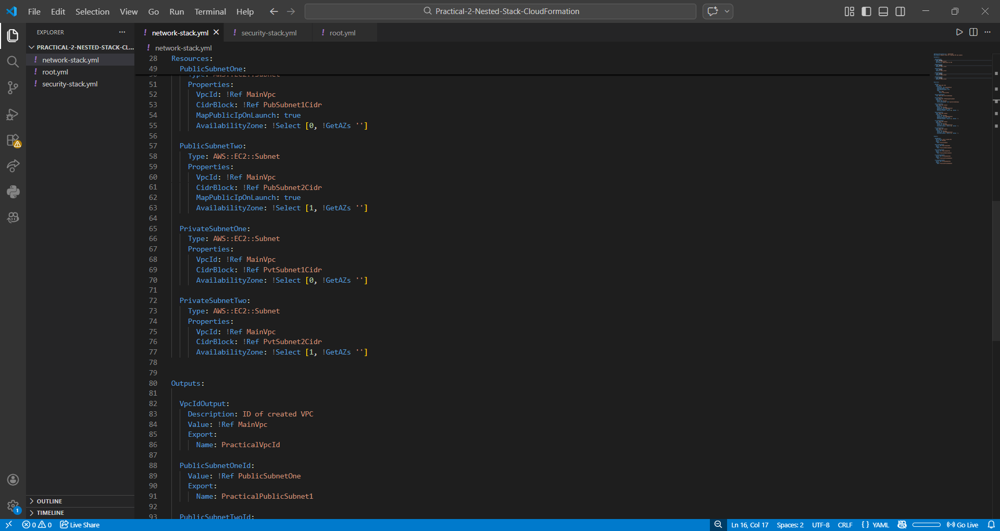

---

### 2️⃣ Created Security Stack
- Created Load Balancer Security Group
  - Allowed HTTP (80)
  - Allowed SSH (22)
- Created Web Server Security Group
  - Allowed traffic only from Load Balancer SG
- Accepted VPC ID as parameter

📷 Screenshot:
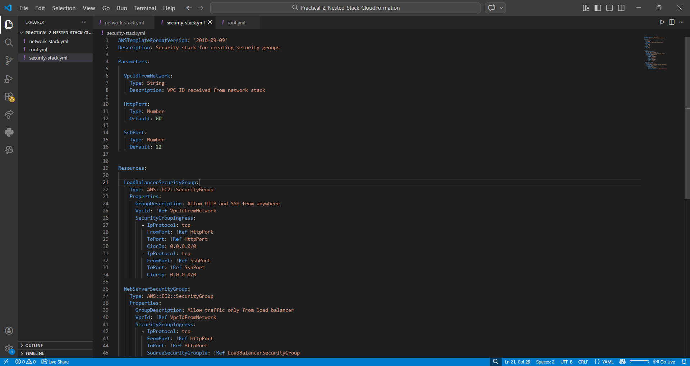
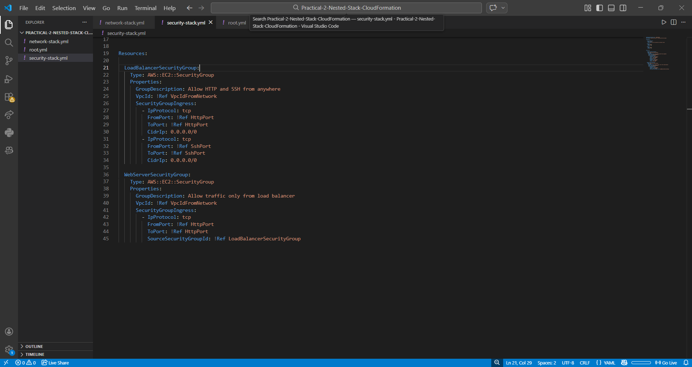

---

### 3️⃣ Created S3 Bucket
- Created S3 bucket
- Uploaded network.yaml and security.yaml
- Copied object URLs

📷 Screenshot:
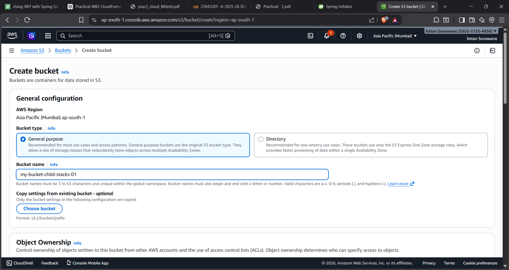
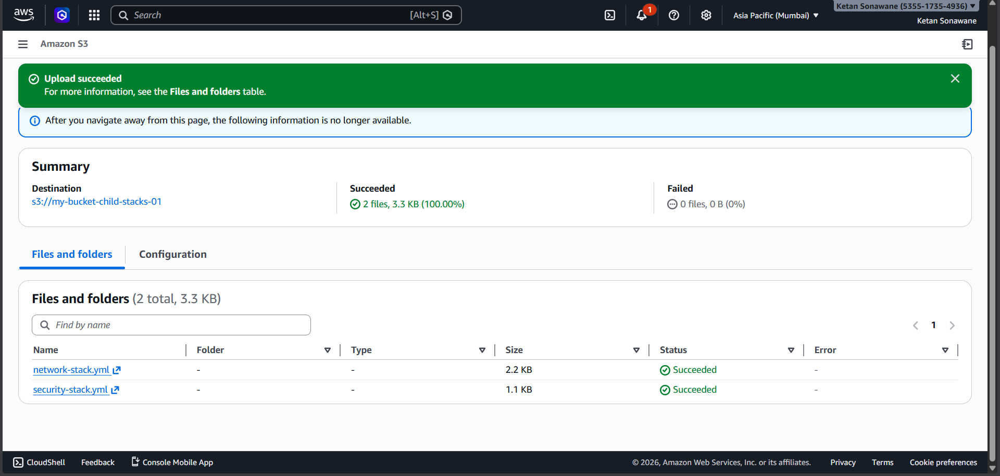

---

### 4️⃣ Updated Root Stack
- Pasted S3 object URLs into TemplateURL
- Passed parameters from root to child stacks
- Used !GetAtt to fetch VPC ID
- Used DependsOn for proper stack creation order

📷 Screenshot:
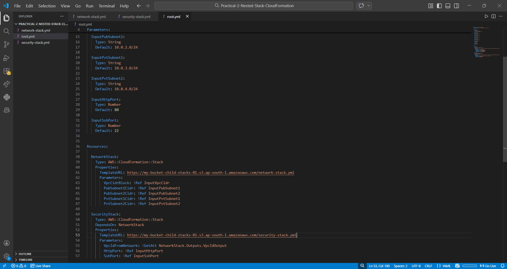

---

### 5️⃣ Deployed Root Stack in CloudFormation
- Uploaded root.yaml
- Entered parameters:
  - VPC CIDR
  - Subnet CIDRs
  - HTTP Port
  - SSH Port
- Created stack

📷 Screenshot:
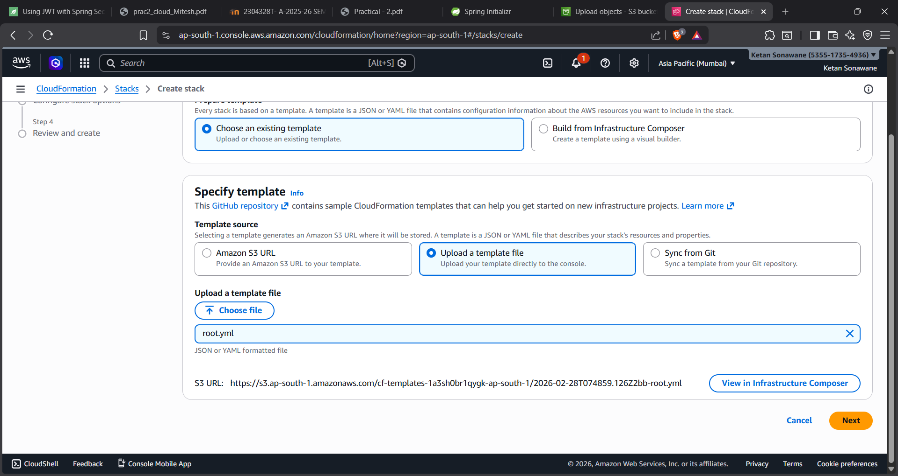
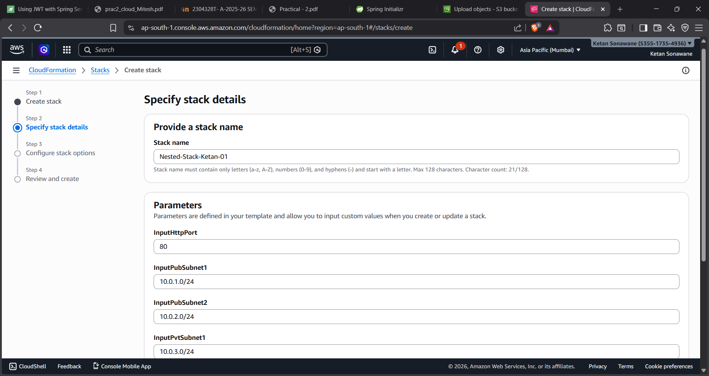
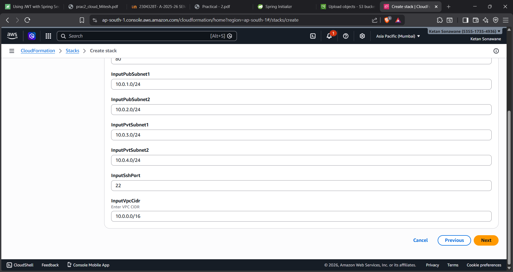
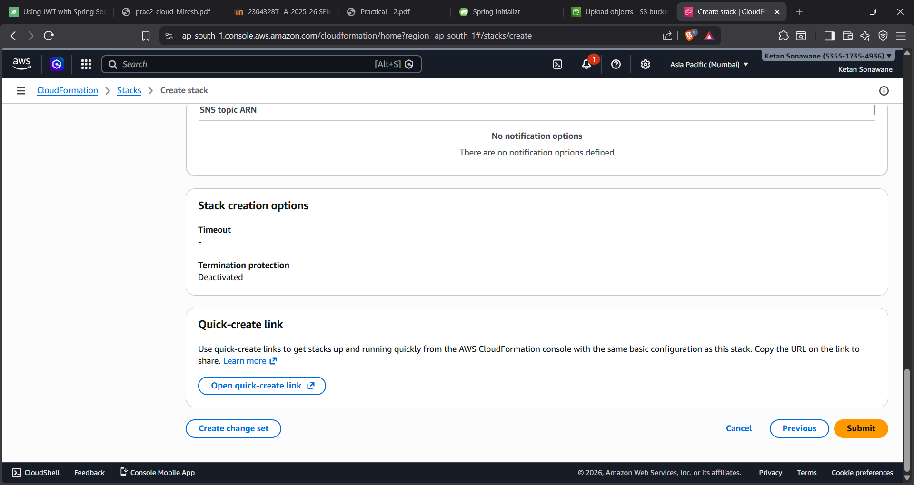
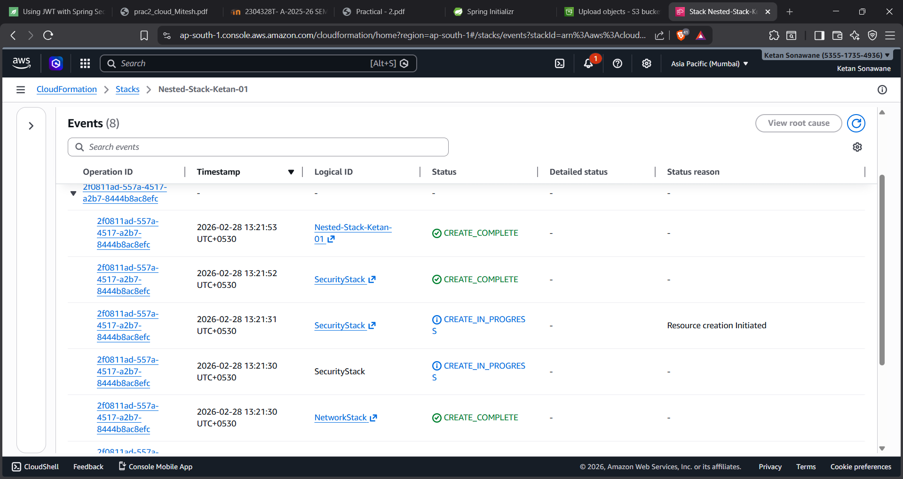

---

### 6️⃣ Verified Resources
- Checked VPC created
- Verified subnets
- Verified security groups
- Confirmed successful stack creation

📷 Screenshot:
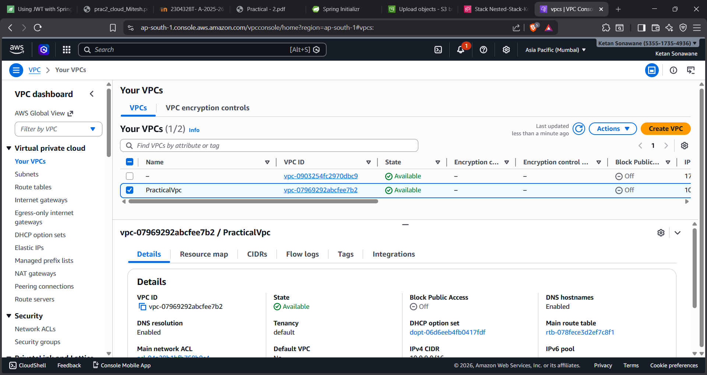
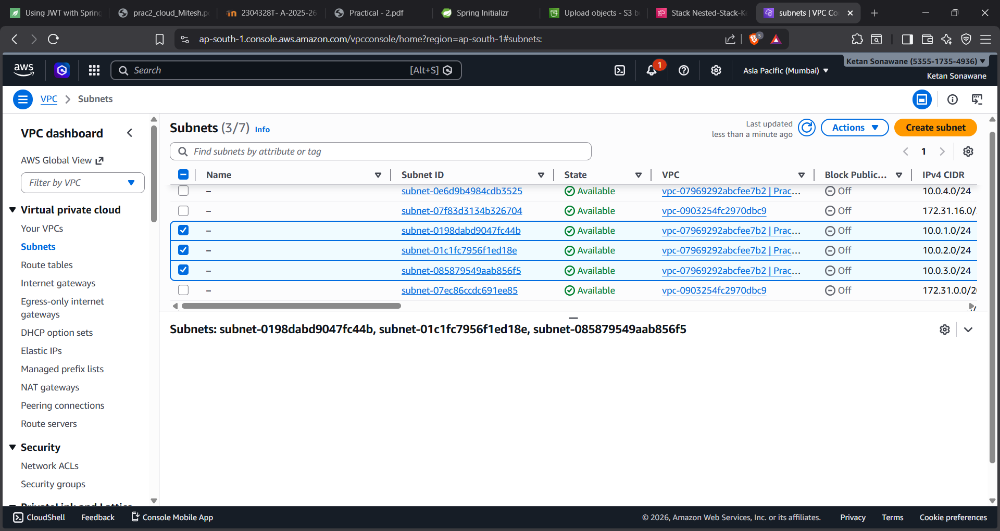
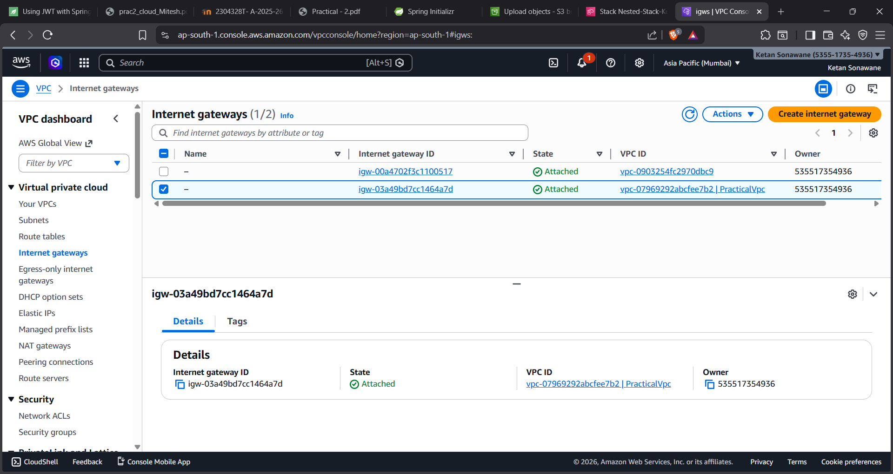
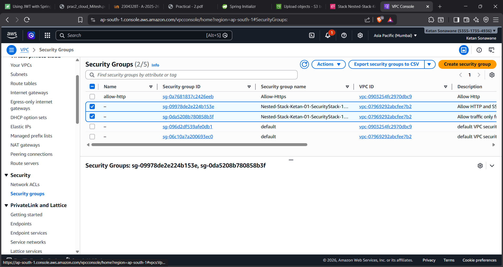
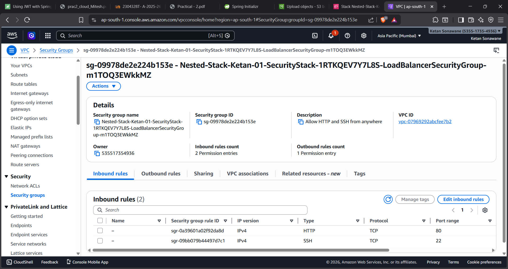

---

### 7️⃣ Deleted Stack
- Deleted root stack
- Confirmed all nested resources were deleted automatically

📷 Screenshot:
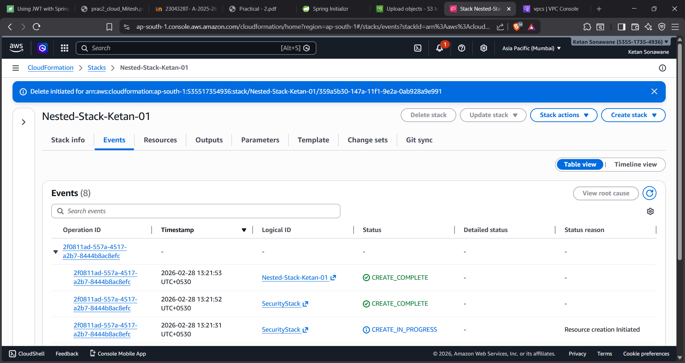
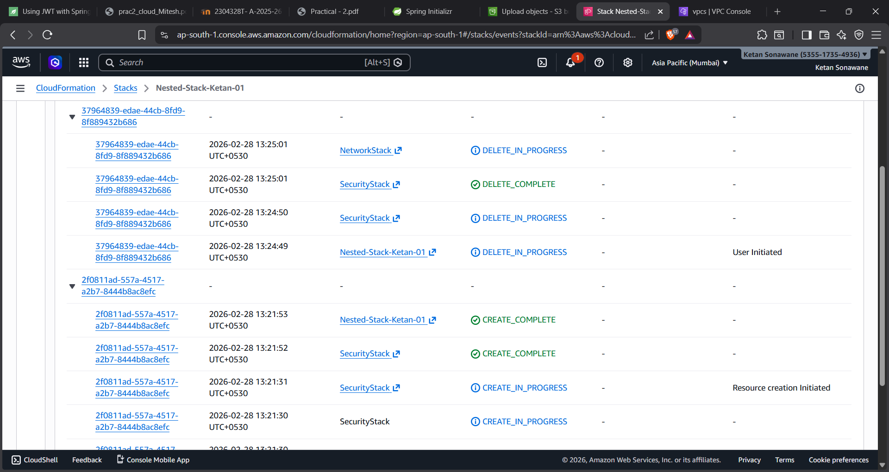

---

## 🔎 Key Concepts Used

- AWS::CloudFormation::Stack (Nested Stacks)
- Parameter Passing
- !Ref
- !GetAtt
- DependsOn
- Outputs and Export

---

## 🎯 What I Learned

- How nested stacks communicate
- How to pass values between stacks
- How CloudFormation manages dependency
- Importance of modular infrastructure design
- Stack lifecycle management (Create → Verify → Delete)

---

## 🔁 Parameter Flow Explanation

User Input  
↓  
Root Stack Parameters  
↓  
Passed to Network Stack  
↓  
VPC Created  
↓  
VPC ID Exported  
↓  
Root Fetches Output  
↓  
Passed to Security Stack  

This ensures dynamic and modular infrastructure creation.

---

## 🧠 Learning Outcomes

Through this project, I learned:

- How nested stacks work
- How to pass parameters between stacks
- Importance of Outputs and Export
- Use of !Ref and !GetAtt
- Managing stack dependencies
- Modular infrastructure design in AWS

---

## 🧹 Cleanup

After verification, the root stack was deleted.  
This automatically deleted the nested stacks and all associated resources to avoid unnecessary AWS charges.

---

## 📌 Conclusion

This practical demonstrates modular infrastructure design using nested stacks in AWS CloudFormation.  
It ensures clean separation between networking and security components while maintaining proper dependency and parameter flow.

---

## 👨‍💻 Author

Ketan Sonawane
AWS CloudFormation Practical  
